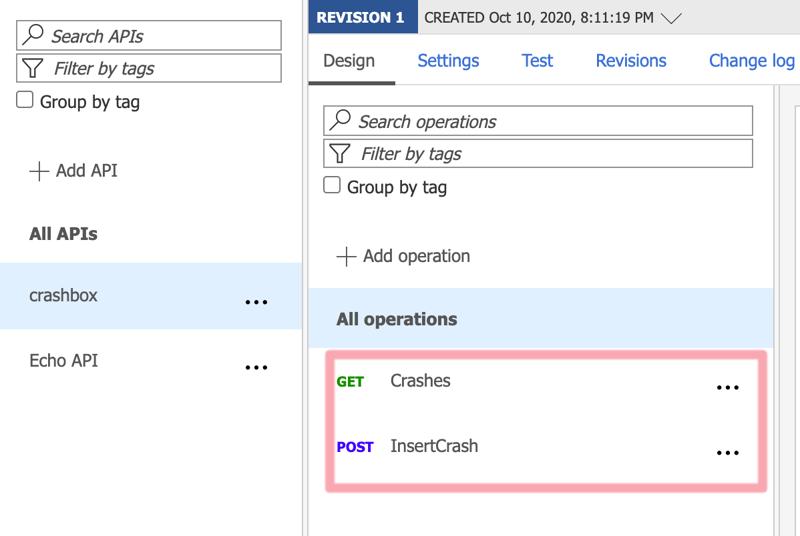

# Crash Box

- [Crash Box](#crash-box)
  - [Next](#next)
  - [Features](#features)
  - [Adding authentication in Angular app](#adding-authentication-in-angular-app)
  - [Securing API Managment](#securing-api-managment)
  - [Create WebAPI with B2C](#create-webapi-with-b2c)
  - [References](#references)
    - [B2C](#b2c)

## Next  

* ~~Setting up Cosmos Db.~~
* Defining the Models.
* Develop the CosmosDb Client.

## Features  
Now with our basic application structure is running, now our plan is to extend our application with more features. The first feature we are going to add is adding Identity to our Angular application.

## Adding authentication in Angular app  
What exactly are we intended by adding Identity into crash box ? Here we are registering an Organization. Each organization will get an API Key, which it can use to send crashes to Crash Box from its client applications. Once logged in the user can view the project wise crashes and details. But for sending a crash to the Crashbox they first need to register an API Key.

Initial steps for setting up B2C tenant and user flows are defined in this blog post. Please refer [here](https://medium.com/@jith/practical-azure-azure-ad-b2c-and-angular-a30e3c2225ee).  

In the Angular side, we are using MSAL library. Please install that library first as mentioned in blog post. There is one major diffrence I have made here from the blog post. Since I have to change the redirect url based on production and development, I decided to add app-config.ts file where all configurations are stored for Azure AD B2C settings. (Its based on this [sample](https://github.com/Azure-Samples/active-directory-b2c-javascript-angular-spa) code.)  

```json
// app-config  

export const msalConfig: Configuration = {
        auth: {
          clientId: "d16c4xxxe57f-4e21-8d16-899db0164ba7", // Application Id of Application registered in B2C
          authority:
            "https://cxxx.b2clogin.com/crashbox.onmicrosoft.com/B2C_1_sisu", //signup-signin userflow
          validateAuthority: false,
          //redirectUri: "http://localhost:4200/",
          redirectUri: "https://cx.z5.web.core.windows.net/",
        },
        cache: {
          cacheLocation: "sessionStorage",
          storeAuthStateInCookie: false,
        },
      };  

```
    
Once the app-config is defined, please update the app-module.ts providers to add MSALService and its configurations.  

```
providers: [
    {
      provide: MSAL_CONFIG,
      useFactory: MSALConfigFactory,
    },
    {
      provide: MSAL_CONFIG_ANGULAR,
      useFactory: MSALAngularConfigFactory
    },
    MsalService
  ],

```  
Basic authentication is handled in the Navbar. We are injecting the Msalservice in the constructor of the required classes. 

## Securing API Managment 

Now we have two API's configured in the API Management, we have to secure the post API with API Key (Subscription key). We have to secure the Get calls with the JWT token (AD B2C)



So in case of Insert Crash (Post), we don't want to apply JWT token,since we don't want all clients to get a JWT token just to send crashes. Each client might have their own login mechanism. In this case we will secure it with a subscription key. So each client should add a subscription key as part of their post request to succeed. 


## Create WebAPI with B2C
At first I am reusing the API registered in B2C tenant for this purpose too. 
Please refer the medium article on how we are doing this. 

At first create the web api as shown below. 

```
dotnet new webapi --auth IndividualB2C 
  --aad-b2c-instance crashbox.b2clogin.com
  --susi-policy-id B2C_1_sisu 
  --client-id xd-559c-4f70-bb04-7fc6b2f6dbee 
  --domain cxbox.onmicrosoft.com
  --name Cxx.WebApi 
  
  ```

I have noticed that  sometimes above command fails, but it creates a Web API with auth. Ensure that you provide the 
B2C configurations. Following are the params for the API registrations we made.  Here is my appsettings.json


```
{
  "AzureAdB2C": {
    "Instance": "https://cxox.b2clogin.com/",  // Check the endpoint 
    "ClientId": "581ffc0d-559c-4f70-bb04-7fc6b2f6dbee", // API registration app id
    "Domain": "crashbox.onmicrosoft.com", // tenant name
    "SignUpSignInPolicyId": "B2C_1_sisu" // user flow in your tenant
  },


```

Now ensure to add CORS support in your 'Startup.cs' .


## References  

### B2C
https://github.com/Azure-Samples/active-directory-b2c-javascript-angular-spa
